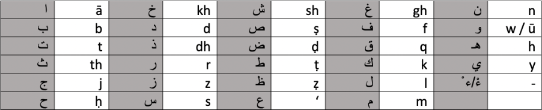
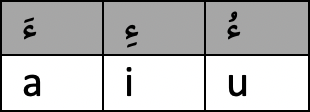

*bismillāh al-raḥmān al-raḥīm*

This post is essentially just to outline how I plan to write Arabic transliteration throughout my blog posts *in shā allāh*. All letters will have unique English transliterations; primarily using 1 letter however some will use two letters which are: ث خ ذ ش غ

Then for some letters a diacritical mark (`.`) will be used to differentiate it from another letter using the same base English letter, these letters are: ح ص ض ط ظ.

Finally, the ع will be the only letter to use a symbol/punctuation mark (`'`) instead of an English letter.

Furthermore, another diacritical mark (`¯`) will be used to differentiate a long vowel from a short vowel.

As for general rules for how I'll transliterate words and phrases, I'll primarily be following this framework:
- I will transliterate phrases word by word, not connecting them within the transliteration.
- I will in most cases include every *ḥarakah* for each letter, excluding the final letter of a word. With some exceptions where the *ḥarakah* on the final letter is vital for understanding the phrase/word even in the context.
- I will italicise the word or phrase when transliterating Arabic into English.
- When two letters or vowels are next to each other and could be interpreted as a single letter a `-` will be put in between the letters/vowel to clarify what the letter(s)/vowel are.
- A `-` will also be put in between the particle *al* and the actual beginning of the word, for example: *al-raḥmān*.
- The letter used for each vowel will always remain consistent to prevent confusion.

In the image below, you can see the equivalent English transliteration for each letter in the Arabic alphabet:

In this image, you will find the letter for each short vowel:

